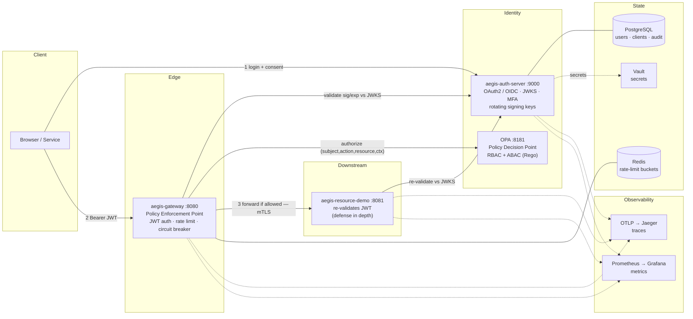

# Aegis — Architecture

## Zero-trust in one sentence
Never trust the network. **Every** request must present a valid, short-lived, cryptographically
signed identity token, and that token is verified at **every** hop — not just at the edge.

## Components

| Component | Role (security term) | Port | Responsibility |
|---|---|---|---|
| `aegis-auth-server` | Identity Provider / Authorization Server | 9000 | Authenticate users, issue & sign JWTs, manage clients/consent |
| `aegis-gateway` | Policy Enforcement Point (PEP) | 8080 | Validate token, rate-limit, ask PDP for authz decision, forward |
| OPA (Rego) | Policy Decision Point (PDP) | 8181 | Evaluate policy: is this subject allowed this action on this resource? |
| `aegis-resource-demo` | Protected Resource | 8081 | Business logic; re-validates token locally (defense in depth) |
| PostgreSQL | State | 5432 | Users, clients, authorizations, audit log |
| Redis | Ephemeral state | 6379 | Rate-limiter counters, (later) token/session cache |
| Jaeger | Trace backend | 16686 | Receives OTLP spans; end-to-end trace search UI |
| Prometheus | Metrics | 9090 | Scrapes `/actuator/prometheus` on each service |
| Grafana | Dashboards | 3000 | Visualizes Prometheus metrics + Jaeger traces |

## System diagram



## Request flow (end-to-end)

```
                    (1) login + consent
   Browser/Client ───────────────────────────▶  Auth Server (9000)
        │                                            │  issues signed JWT (5-min TTL)
        │  ◀─────────────────────────────────────────┘  + rotating refresh token
        │
        │  (2) GET /api/demo/whoami   Authorization: Bearer <JWT>
        ▼
     Gateway (8080)  ── validate JWT sig+exp against Auth Server JWKS
        │            ── rate limit (Redis token bucket, keyed per user/client)
        │            ── call PDP with {subject, action, resource, context} ──▶ OPA (8181)
        │            ◀── allow / deny ────────────────────────────────────────┘
        │  (3) forward if allowed, else 403 (fail closed if OPA is unreachable)
        │      downstream call guarded by a Resilience4j circuit breaker
        │      (breaker open → local 503 fallback, no pile-up on a sick service)
        ▼
  Resource Demo (8081) ── re-validate JWT (never assume gateway is the only door)
        │
        ▼  (4) 200 { subject, issuer, scopes, ... }
```

### Authorization input & policy (Phase 3)
The gateway sends OPA an `input` of `{ subject {id, roles, scopes, tenant}, action (HTTP method),
resource {path, segments}, context {ip, hour} }` and reads back a boolean `allow`. Policies live in
`policies/authz.rego` (with `authz_test.rego`) and cover RBAC (admin role, `demo.read`/`demo.write`
scopes) and ABAC (resource ownership on `/api/users/{id}`, business-hours-only writes). The auth
server adds a `roles` claim to user access tokens so RBAC has roles to evaluate.

### Observability & resilience (Phase 4)
Every service bridges **Micrometer Tracing → OpenTelemetry** and exports spans over **OTLP** to
Jaeger, so a single request produces one trace spanning gateway → resource-demo (context propagates
on the forwarded call). **Prometheus** scrapes each service's `/actuator/prometheus`; **Grafana**
visualizes both. Under the `prod` profile logs are **ECS JSON on stdout** with `traceId`/`spanId` in
every line (correlating logs to traces; tokens are never logged). Resilience lives at the edge: the
Redis rate limiter is keyed **per user / per client** (fairness), and the downstream route is wrapped
in a **Resilience4j circuit breaker** that fails fast to a local 503 fallback when the service is
unhealthy — so one bad dependency can't cascade.

## Key security decisions (and why)
- **Short-lived access tokens (5 min)** — limits blast radius of a leaked token; refresh tokens
  are **rotated** and single-use so theft is detectable.
- **JWT (asymmetric RS256)** — services validate offline using the public JWKS; the private key
  never leaves the auth server.
- **Validate at every boundary** — the gateway *and* each service check the token. A compromised
  or bypassed gateway must not grant free access (this is the core of "zero trust").
- **Flyway-owned schema, `ddl-auto: validate`** — the app never mutates schema at runtime.
- **Separation of concerns** — authN (auth server) vs. enforcement (gateway PEP) vs. authZ policy
  (OPA PDP) are independent and independently testable; policy changes ship without redeploying code.

## Trust boundaries
1. Internet ↔ Gateway (untrusted → semi-trusted; strongest checks here)
2. Gateway ↔ Services (JWT re-validated **and**, under the `mtls` profile, mutual TLS: the service
   requires a CA-signed client cert only the gateway holds — workload identity on top of user identity)
3. Services ↔ Postgres/Redis (network-isolated; credentials env-first and, with the `vault`
   profile, served from HashiCorp Vault rather than any config file)

See `THREAT_MODEL.md` for the STRIDE analysis of these boundaries.
